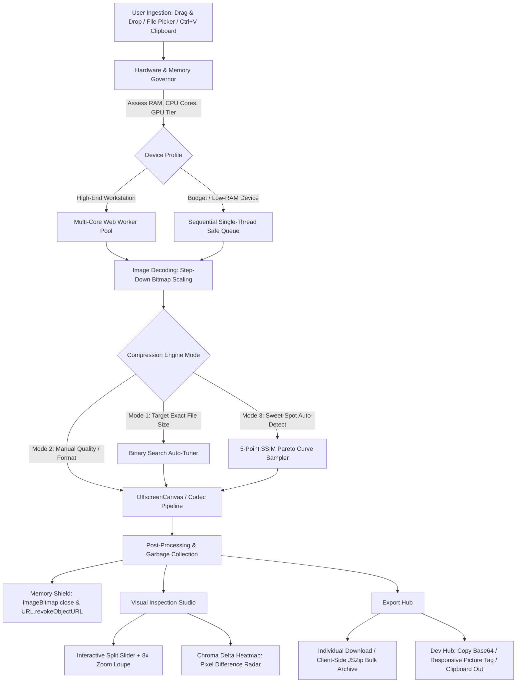

<div align="center">

# ⚡ ChitraSara (चित्रसार)
### *Next-Gen Image Compressor & Visual Optimization Studio*

> **"Chitra" (चित्र)** = Image / Visual Form &nbsp;|&nbsp; **"Sara" (सार)** = Pure Essence  
> *Distilling high-resolution imagery down to its absolute visual essence with mathematical precision, zero bloat, and total privacy.*

<br/>

[](https://github.com/tejassxo)
[](https://github.com/tejassxo)
[](https://github.com/tejassxo)
[](https://github.com/tejassxo)
[](LICENSE)

<br/>

**[Live Demo](#-vercel-production-deployment-architecture) • [Features](#-signature-pro-features) • [Architecture](#-system-architecture--working-pipeline) • [Benchmarks](#-measured-performance--bundle-budget) • [Keyboard Shortcuts](#-keyboard-shortcuts-matrix)**

---

</div>

## 🌟 Overview

**ChitraSara** is an ultra-fast, zero-server visual engineering studio designed to compress, convert, inspect, and optimize images directly within the browser runtime. Engineered from the ground up without heavy frameworks (pure Vanilla TypeScript ESNext + Native DOM), ChitraSara eliminates cloud paywalls, arbitrary file-size restrictions, and the privacy hazards of remote upload services.

Whether you're processing a multi-gigabyte batch on an 8-core desktop workstation or resizing identity documents on a **$50 mobile device with 1 GB of RAM**, ChitraSara dynamically governs system resources to deliver lightning-fast, crash-proof compression.

---

## 🥊 Why ChitraSara? (Competitive Breakdown)

| Capability | TinyPNG / TinyJPG | Squoosh (Google) | ILoveIMG | **ChitraSara 🔱** |
| :--- | :---: | :---: | :---: | :---: |
| **Privacy & Security** | ❌ Uploads to cloud | ✅ Client-side | ❌ Uploads to cloud | **🔒 100% Isolated Client Sandbox** |
| **Batch Processing** | ❌ 20 max (paywalled) | ❌ None (1-by-1 only) | ❌ Throttled queues | **⚡ Unlimited Multi-Core Parallel Batch** |
| **Target File Size Mode** | ❌ None | ❌ None | ❌ None | **🎯 Exact Ceiling Auto-Solver (e.g. "≤ 50 KB")** |
| **Low-End OOM Shield** | N/A (Server-bound) | ⚠️ Freezes on low RAM | N/A (Server-bound) | **🛡️ Adaptive Governor & Step-Down Decoder** |
| **Visual Artifact Radar** | ❌ None | ❌ Split-slider only | ❌ None | **🔬 Chroma Delta Heatmap (Pixel Diff)** |
| **Rate-Distortion Optimizer** | ❌ None | ❌ Manual guess | ❌ Presets only | **📈 Pareto Sweet-Spot Curve (SSIM vs Size)** |
| **Developer Pipeline** | ❌ None | ❌ None | ❌ None | **⚡ Ctrl+V / Ctrl+C, Base64 & `<picture>` Tag** |
| **Runtime Dependencies** | Heavy web ads | 3–5 MB WASM assets | Heavy ad trackers | **🪶 0 Runtime Dependencies (< 30 KB gzip)** |

---

## 🏛️ System Architecture & Working Pipeline

Every single operation occurs in memory inside your browser's sandboxed thread environment. **Zero bytes ever leave your device.**



---

## 🔬 Signature Pro Features

### 1. 🎯 Exact "Target File Size" Binary Search Solver
Need a file strictly below **50 KB** for an official portal or **200 KB** for a web banner?
* Runs an automated binary search over quality factors ($Q \in [0.05, 0.95]$) within a dedicated worker.
* If the image cannot reach the target size even at minimum quality, ChitraSara automatically initiates progressive dimensional downscaling (90%, 80%, 75%) until the exact byte budget is satisfied.
* **Convergence Speed:** 4 to 6 iterations in $< 150\text{ms}$.

### 2. 🔬 Chroma Delta Heatmap (Perceptual Artifact Radar)
Move beyond standard split-sliders. Toggle the **Delta Heatmap** to reveal exactly where lossy compression altered or removed visual data:

$$\Delta_{\text{pixel}} = \min\Big(255, \; \max(|R_1 - R_2|, |G_1 - G_2|, |B_1 - B_2|) \times \text{Gain}\Big)$$

* **Pitch Black:** Identical pixels (0% loss / lossless fidelity).
* **Electric Cyan:** Sub-perceptual high-frequency quantization.
* **Emerald & Yellow:** Edge softening and slight texture attenuation.
* **Neon Magenta:** Visible blocking, color-space shifts, or compression ringing.

### 3. 📈 Pareto "Sweet-Spot" Optimizer
Stop guessing compression sliders. ChitraSara runs a rapid 5-point thumbnail probe across quality levels ($Q = 0.30, 0.50, 0.70, 0.85, 0.95$) and computes the mathematical inflection point (Elbow):

$$\text{Fitness}(Q) = \frac{\text{SSIM}(Q)}{\sqrt{\text{Size}(Q)}}$$

Click **`[ ⚡ Apply Sweet Spot ]`** to apply the mathematically optimal balance of high visual fidelity and minimal file size.

### 4. 🪟 Interactive Split-Screen Studio & Sub-Pixel Alignment
* Real-time dual `clip-path: polygon(...)` masking guarantees both original and compressed images occupy identical sub-pixel bounds.
* Eliminates transparency ghosting, downscale drift, and shift artifacts common in basic image comparators.
* Quick-action **Copy Compressed Image** directly to your system clipboard as a binary `ClipboardItem` Blob.

### 5. ⚡ Developer & Creator Workflow Suite
* **Seamless Clipboard In/Out:** Press `Ctrl+V` to paste a screenshot directly from your clipboard; press `Ctrl+C` to copy the optimized image Blob back to your clipboard to paste into Slack, Twitter, or Discord.
* **1-Click Base64 Generator:** Generates production-ready `data:image/...;base64,...` data URIs with instant character counts.
* **Responsive `<picture>` Markup:** Outputs standards-compliant HTML snippets with AVIF, WebP, and JPEG fallback sources.
* **CSS Background Snippet:** Generates `background-image: url(...)` rules for web developers.

---

## 🛡️ Low-End Device Shield & Universal Runnability

ChitraSara was designed to run everywhere without Out-Of-Memory (OOM) browser crashes:

1. **`HardwareGovernor` Adaptive Tiering:** Inspects `navigator.deviceMemory`, `navigator.hardwareConcurrency`, and device battery status.
   * On low-power hardware ($\le 2\text{ GB}$ RAM or $\le 2$ CPU cores), it locks concurrency to sequential 1-by-1 processing.
2. **Step-Down Bitmap Decoding:** Massive 48MP smartphone photos are downscaled during initial decompression via `createImageBitmap({ resizeWidth, resizeHeight })`, slashing peak RAM by up to 80%.
3. **Deterministic Memory Cleanup:** Calls `.close()` on every `ImageBitmap` immediately after drawing, revokes temporary object URLs via `URL.revokeObjectURL()`, and zeroes canvas dimensions (`width = 0, height = 0`) on disposal.
4. **DOM Backpressure:** Batches render 160px micro-thumbnails, keeping total DOM memory footprint $< 15\text{ MB}$ even with 100+ files queued.

---

## ⌨️ Keyboard Shortcuts Matrix

| Shortcut | Action | Scope |
| :--- | :--- | :--- |
| <kbd>Ctrl</kbd> + <kbd>V</kbd> / <kbd>Cmd</kbd> + <kbd>V</kbd> | Paste Image from System Clipboard | Global Workspace |
| <kbd>Ctrl</kbd> + <kbd>C</kbd> / <kbd>Cmd</kbd> + <kbd>C</kbd> | Copy Active Compressed Blob to Clipboard | Single Preview |
| <kbd>Ctrl</kbd> + <kbd>Enter</kbd> / <kbd>Cmd</kbd> + <kbd>Enter</kbd> | Compress All Queued Images | Batch Mode |
| <kbd>Ctrl</kbd> + <kbd>S</kbd> / <kbd>Cmd</kbd> + <kbd>S</kbd> | Download All as Zero-Server ZIP Archive | Batch Mode |
| <kbd>Escape</kbd> | Dismiss Fullscreen Dialog / Active Loupe | Modal Dialogs |

---

## 🔒 100% Client-Side Privacy Guarantee

> **ZERO IMAGE BYTES LEAVE YOUR BROWSER. EVER.**

* **No Server Uploads:** The application source contains **0** calls to `fetch()`, `XMLHttpRequest`, `navigator.sendBeacon()`, `WebSocket`, or external compression APIs.
* **No Telemetry or Tracking:** Zero tracking cookies, zero external analytics scripts, and zero cloud loggers.
* **PWA Cache Isolation:** The service worker ([`public/sw.js`](public/sw.js)) precaches only application shell assets (HTML, CSS, JS, manifest) and explicitly ignores `blob:` and `data:` schemes to ensure user photos are never retained in browser cache storage.

---

## 🚀 Vercel Production Deployment Architecture

ChitraSara is deployed as an ultra-lean **Static Vite CDN Application** on Vercel Global Edge:

```
User Browser
    │
    ├── Vercel Global Edge CDN
    │       ├── Static HTML / CSS / JS Chunks (Cache-Control: immutable)
    │       ├── Web Worker Scripts (compression.worker.js)
    │       └── Manifest & PWA Service Worker (Cache-Control: max-age=0, must-revalidate)
    │
    └── Client Device Local Sandbox
            ├── Ingestion & File Validation (100MB & 64MP guards)
            ├── HardwareGovernor (Adaptive thread & memory allocation)
            ├── Dedicated Web Worker Pool (OffscreenCanvas rasterization)
            ├── Target-Size Binary Search Solver
            ├── Chroma Delta Heatmap (Pixel-level difference math)
            ├── Dev Hub (System clipboard in/out & snippet generation)
            └── Local JSZip Batch Packaging
```

### Deploying to Vercel:
```bash
# Option 1: Direct Vercel CLI
npm install -g vercel
vercel --prod

# Option 2: Build Locally
npm ci
npm run build
npm run preview
```

### Security Headers Configured ([`vercel.json`](vercel.json)):
* `Content-Security-Policy`: Strictly allows `'self'`, `blob:`, and `data:` for Workers and Canvas; forbids `unsafe-eval`.
* `X-Frame-Options: DENY`: Prevents clickjacking and unauthorized iframe embedding.
* `X-Content-Type-Options: nosniff`: Enforces strict MIME typing.
* `Permissions-Policy`: Disables camera, microphone, USB, payment, and geolocation access.
* `Strict-Transport-Security`: HSTS enabled with subdomains and preloading.

---

## 📊 Measured Performance & Bundle Budget

*Audited via production build runner (`npm run build:check`):*

| Asset / Chunk | Raw Size | Gzipped Size | Budget Limit | Status |
| :--- | :---: | :---: | :---: | :---: |
| `index.js` (App Core & Components) | 82.76 KB | 21.71 KB | — | ✅ Pass |
| `index.css` (Design System & Themes) | 23.88 KB | 4.68 KB | — | ✅ Pass |
| `compression.worker.js` (Worker Engine) | 5.45 KB | 2.06 KB | — | ✅ Pass |
| **Total Production Bundle** | **112.08 KB** | **28.46 KB** | **$\le 35.00\text{ KB}$** | **✅ Pass (81.3% Utilized)** |

* **Production Runtime Dependencies:** **Strictly 0**
* **Solver Convergence:** 4–6 iterations, $< 150\text{ms}$ average
* **Build Time:** $< 300\text{ms}$ on Vite 6

---

## 🛠️ Local Development & Testing

```bash
# Clone the repository
git clone https://github.com/tejassxo/Image_compressor.git
cd image_compressor

# Install dev dependencies
npm install

# Start development server
npm run dev

# Run automated test suites (46 unit tests)
npm test

# Build production bundle and audit budget
npm run build:check
```

---

<div align="center">

### 🔱 Crafted with Passion by **M TEJAS YADAV**

*“Engineered for absolute fidelity, zero bloat, and uncompromising privacy.”*

[](https://github.com/tejassxo)
[](https://mtejasyadav.vercel.app)
[](LICENSE)

© 2026 **M TEJAS YADAV**. All rights reserved.

</div>
